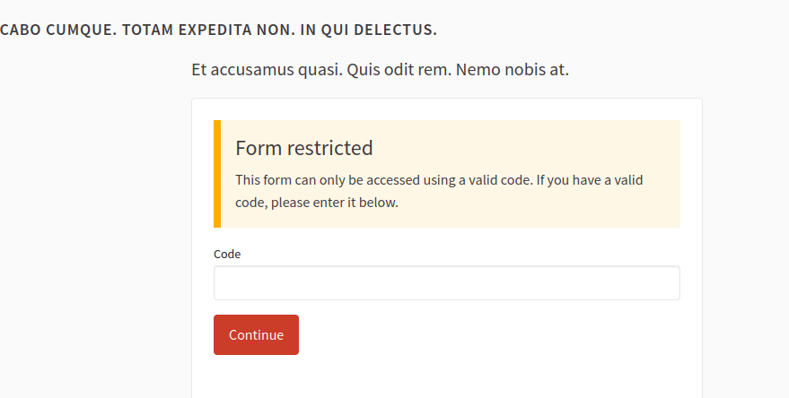

# Decidim::AnonymousCodes

[![[CI] Lint](https://github.com/openpoke/decidim-module-anonymous_codes/actions/workflows/lint.yml/badge.svg)](https://github.com/openpoke/decidim-module-anonymous_codes/actions/workflows/lint.yml)
[![[CI] Test](https://github.com/openpoke/decidim-module-anonymous_codes/actions/workflows/test.yml/badge.svg)](https://github.com/openpoke/decidim-module-anonymous_codes/actions/workflows/test.yml)
[](https://codeclimate.com/github/openpoke/decidim-module-anonymous_codes/maintainability)
[](https://codecov.io/gh/openpoke/decidim-module-anonymous_codes)

This module provides the ability restrict access to certain resources (currently Surveys) in Decidim by using anonymous codes. The implementation is based on the idea of providing a code to the user that allows them to access the resource without the need to be logged in.

However, it is also compatible with the setting "allow users to answer the survey without login" so administrators can decide wheter if users with valid codes need to be logged in or not.

## Installation

Add this line to your application's Gemfile:

```ruby
gem 'decidim-anonymous_codes', github: 'openpoke/decidim-module-anonymous_codes'

```

And then execute:

```bash
bundle
bin/rails decidim:upgrade
bin/rails db:migrate
```

> **EXPERTS ONLY**
>
> Under the hood, when running `bundle exec rails decidim:upgrade` the `decidim-anonymous_codes` gem will run the following (that can also be run manually if you consider):
> 
> ```bash
> bin/rails decidim_anonymous_codes:install:migrations
> ```

## Usage

The first step is to create a group of codes in the admin, for this there is a specific menu in the admin panel.

When a group is created, then the admin can generate codes for that group. The codes can be generated in bulk.
A group can be set with and expiration date, make it active or not and link it to a particular resource (a survey in Decidim). Many groups can be linked to the same resource as well.

When a user tries to access a resource that is protected by anonymous codes, they will be prompted to enter the code.

Codes can also be exported and the final URL to answer the survey is provided in the exported file (with this URL the survey access will be granted without the need to enter the code).

## Configuration

By default, the module is configured to read the configuration from ENV variables.

Currently, the following ENV variables are supported:

| ENV variable | Description | Default value |
| ------------ | ----------- |-------|
| ANONYMOUS_CODES_DEFAULT_TOKEN_LENGTH | The length of the codes generated if using the default token generator | `10` |
| ANONYMOUS_CODES_TOKEN_STYLE | The type of codes generated if using the default token generator (options are `alphanumeric`, `numeric`). (note that "numeric" still returns a string, just only formed by number chars) | `alphanumeric` |

It is also possible to configure the module using the `decidim-anonymous_codes` initializer:

Create an initializer (for instance `config/initializers/anonymous_codes.rb`) and configure the following:

```ruby
# config/initializers/anonymous_codes.rb

Decidim::AnonymousCodes.configure do |config|
  # The length of the codes generated if using the default alphanumeric generator
  config.default_token_length = 10

  # The generator to use for the codes (defaults to an alphanumeric uppercase string of length "default_token_length")
  # if you customize this, the default_token_length will be ignored
  def self.token_generator
    SecureRandom.hex(25)
  end
end
```

## Screenshots



Admin panel

TODO

## Contributing

Bug reports and pull requests are welcome on GitHub at https://github.com/openpoke/decidim-module-anonymous_codes.

### Developing

To start contributing to this project, first:

- Install the basic dependencies (such as Ruby and PostgreSQL)
- Clone this repository

Decidim's main repository also provides a Docker configuration file if you
prefer to use Docker instead of installing the dependencies locally on your
machine.

You can create the development app by running the following commands after
cloning this project:

```bash
$ bundle
$ DATABASE_USERNAME=<username> DATABASE_PASSWORD=<password> bundle exec rake development_app
```

Note that the database user has to have rights to create and drop a database in
order to create the dummy test app database.

Then to test how the module works in Decidim, start the development server:

```bash
$ cd development_app
$ DATABASE_USERNAME=<username> DATABASE_PASSWORD=<password> bundle exec rails s
```

In case you are using [rbenv](https://github.com/rbenv/rbenv) and have the
[rbenv-vars](https://github.com/rbenv/rbenv-vars) plugin installed for it, you
can add the environment variables to the root directory of the project in a file
named `.rbenv-vars`. If these are defined for the environment, you can omit
defining these in the commands shown above.

#### Code Styling

Please follow the code styling defined by the different linters that ensure we
are all talking with the same language collaborating on the same project. This
project is set to follow the same rules that Decidim itself follows.

[Rubocop](https://rubocop.readthedocs.io/) linter is used for the Ruby language.

You can run the code styling checks by running the following commands from the
console:

```
$ bundle exec rubocop
```

To ease up following the style guide, you should install the plugin to your
favorite editor, such as:

- Atom - [linter-rubocop](https://atom.io/packages/linter-rubocop)
- Sublime Text - [Sublime RuboCop](https://github.com/pderichs/sublime_rubocop)
- Visual Studio Code - [Rubocop for Visual Studio Code](https://github.com/misogi/vscode-ruby-rubocop)

### Testing

To run the tests run the following in the gem development path:

```bash
$ bundle
$ DATABASE_USERNAME=<username> DATABASE_PASSWORD=<password> bundle exec rake test_app
$ DATABASE_USERNAME=<username> DATABASE_PASSWORD=<password> bundle exec rspec
```

Note that the database user has to have rights to create and drop a database in
order to create the dummy test app database.

In case you are using [rbenv](https://github.com/rbenv/rbenv) and have the
[rbenv-vars](https://github.com/rbenv/rbenv-vars) plugin installed for it, you
can add these environment variables to the root directory of the project in a
file named `.rbenv-vars`. In this case, you can omit defining these in the
commands shown above.

### Test code coverage

If you want to generate the code coverage report for the tests, you can use
the `SIMPLECOV=1` environment variable in the rspec command as follows:

```bash
$ SIMPLECOV=1 bundle exec rspec
```

This will generate a folder named `coverage` in the project root which contains
the code coverage report.

### Localization

If you would like to see this module in your own language, you can help with its
translation at Crowdin:

https://crowdin.com/project/decidim-anonymous_codes

## License

See [LICENSE-AGPLv3.txt](LICENSE-AGPLv3.txt).
